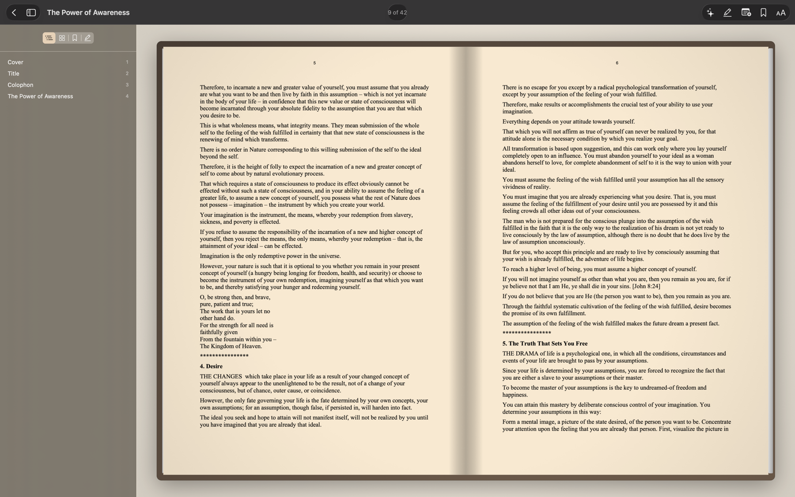
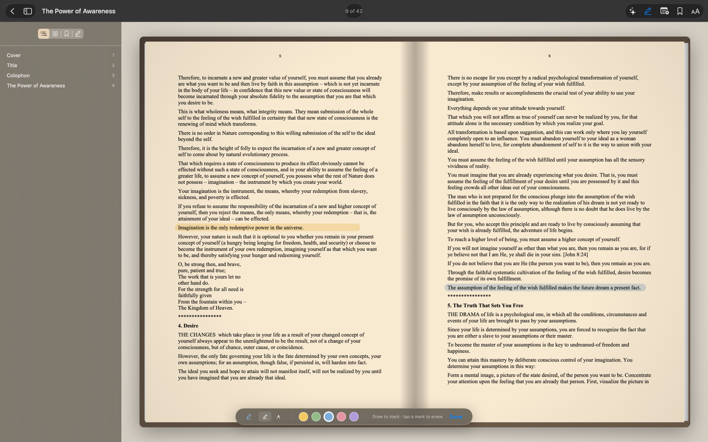
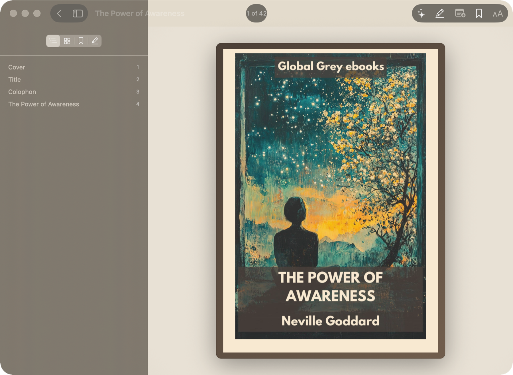
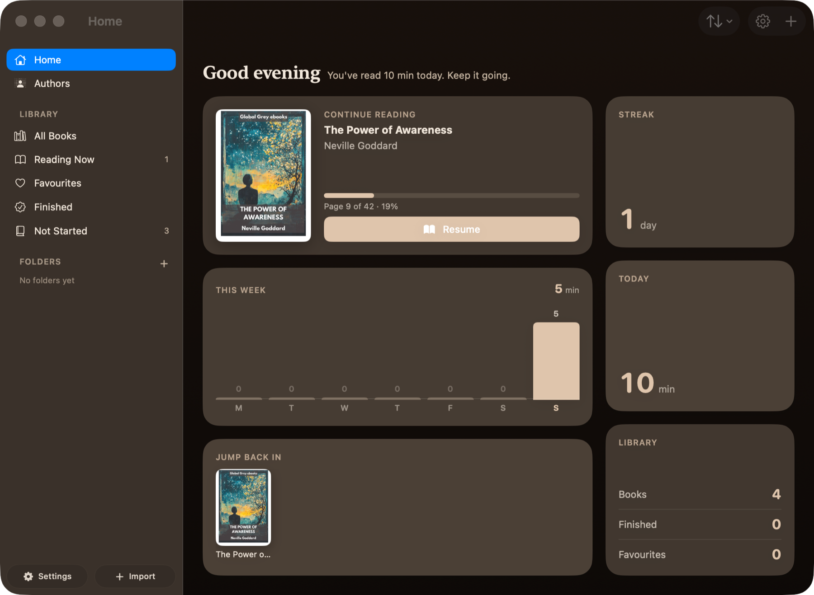
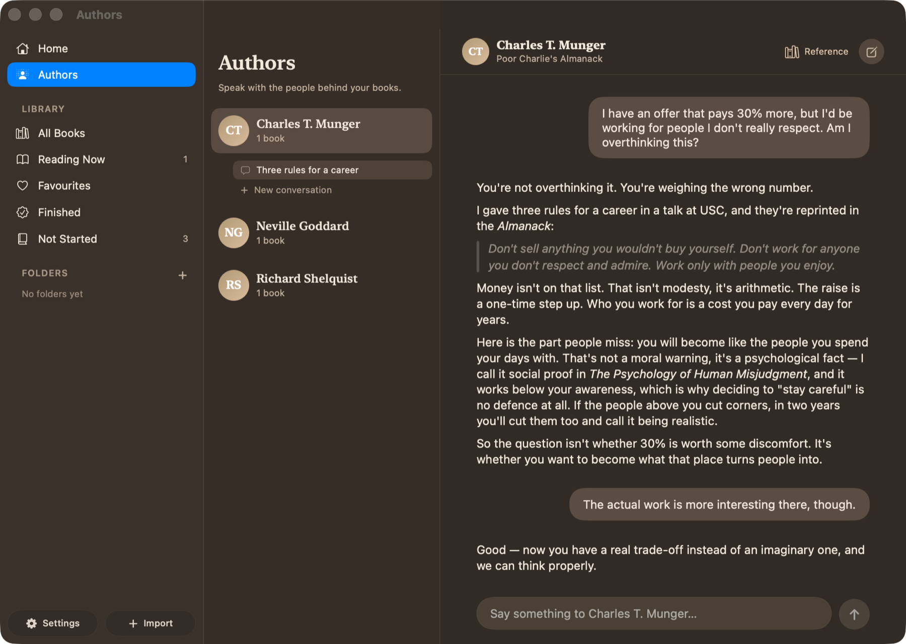

<div align="center">

# Flipbook

**A macOS reader that treats a PDF like a book — and lets you talk to the people who wrote them.**

[](https://www.apple.com/macos/)
[](https://swift.org)
[](LICENSE)
[](#ai)

</div>



Flipbook renders PDFs as a bound two-page spread — cover board, centre spine, stacked page
edges — and turns pages with a gesture-tracked 3D flip rather than a cross-fade. Around that
sits a library, an annotation layer, reading stats, and an AI companion that answers from the
actual text of your books.

Native SwiftUI and AppKit. No backend, no account, no telemetry.

---

## Contents

- [Reading](#reading)
- [Annotation](#annotation)
- [Library](#library)
- [AI](#ai)
- [Privacy](#privacy)
- [Build](#build)
- [Architecture](#architecture)
- [Roadmap](#roadmap)
- [License](#license)

---

## Reading

The page turn is a Core Animation transform tracked 1:1 against the trackpad. Each face shades
itself as it lifts, the turning sheet casts a moving shadow on the page beneath, and the release
spring carries your gesture's velocity. It's interruptible and reversible mid-turn.

| | |
|---|---|
| **Book mode** | Two-page spread; narrow windows fall back to one large page. |
| **Continuous scroll** | Lazy vertical stack of rendered pages, pinch to zoom. |
| **Reflow** | The text re-typeset in your own font and size. |
| **Themes** | Nine: Warm Paper, Eggshell, Cream, Beige, Sepia, Original, Dark Grey, Midnight, True Black — plus warmth and brightness trim. |
| **Contents** | Uses the PDF outline, or synthesises one from printed contents pages and font-metric heading detection. |
| **Night mode** | Switches to your dark theme between 8 PM and 7 AM. |
| **Focus mode** | Chrome hidden, sidebar collapsed, full screen. |

Themes are applied to the rasterised page by a Core Image compositor and cached, not layered over
it at draw time. Dark themes use a lightness-preserving smart invert that keeps photographs
positive instead of colour-negating them.

---

## Annotation



- **Freehand highlighter** — drag to mark, tap a mark to erase, five colours
- **Sticky notes** — drop one anywhere on a page, drag it, click to collapse
- **Bookmarks** with a ribbon on the page (⌘D)
- Real text selection on text PDFs; region highlighting on scans

---

## Library



Shelves compute themselves from reading progress — **All Books, Reading Now, Favourites,
Finished, Not Started** — alongside folders, search, and sorting by date added, last read, title,
or author. Books are referenced by security-scoped bookmark, so moving a PDF on disk doesn't break
the library; if resolution ever fails, a *Locate File…* flow relinks it.



The dashboard tracks daily minutes, a weekly chart, streaks, and an optional daily goal.

---

## AI



Two features, both bring-your-own-key:

**Ask about what you're reading.** A panel in the reader that receives the current page's text
automatically, so "explain this page" works without copy-paste.

**Talk to the Author.** Every author in your library becomes someone you can question. Pick
whether a conversation draws on one book or everything that author wrote; threads are saved per
author and persist across launches.

### Making a book fit in a prompt

A 400-page book is roughly 250k–1M tokens. It can't go in a prompt on every message, so Flipbook
distils it once, with a map–reduce pass built around cost:

```
book text ──▶ ~28k-char chunks ──▶ summarised 4-at-a-time by the provider's CHEAPEST model
                                    (Claude Haiku · gpt-5-mini · Gemini Flash)
                                              │
                                    chunk notes (a few thousand tokens)
                                              │
                                    one compose call on your main model
                                              │
                                    BookDigest, cached forever in SwiftData
                                    overview · arguments · structure · key terms
                                    · voice · worldview · verbatim quotes
```

Nearly all the tokens are spent in the map phase, and the map phase runs on the cheap tier — so
distilling a whole book costs cents, once. A unit test asserts the bulk model is never the
flagship, so that can't silently regress.

The persona is built the same way and cached: a character file covering biography, convictions,
reasoning habits, voice, and how that author advises — grounded in the digests plus the model's
knowledge of the real person. At conversation time it's composed with the in-scope digests, which
is why the replies quote the book rather than paraphrase it.

### Providers

Anthropic uses its native Messages API; the rest are OpenAI-Chat-Completions compatible and share
one client. Both formats stream over SSE behind a single interface. There's no official Swift SDK
for any of them, so `AIService` speaks the wire protocols directly.

| Provider | Endpoint | Get a key |
|---|---|---|
| Anthropic (Claude) | `api.anthropic.com` | [console.anthropic.com](https://console.anthropic.com/settings/keys) |
| OpenAI | `api.openai.com/v1` | [platform.openai.com](https://platform.openai.com/api-keys) |
| Google Gemini | `generativelanguage.googleapis.com/v1beta/openai` | [aistudio.google.com](https://aistudio.google.com/apikey) |
| YUNWU | `yunwu.ai/v1` | [yunwu.ai](https://yunwu.ai) |

Set up in **Settings → AI**: choose a provider, save the key, test the connection, enable. The
model field is free text with presets, so a model released tomorrow works tomorrow. Assistant
name, response style, and standing instructions are configurable there too.

---

## Privacy

There is no backend. No account, no telemetry, nothing uploaded.

- API keys live in the **macOS Keychain**, one per provider — never in SwiftData, never in a file,
  never in this repo.
- Requests go straight from your Mac to the provider you chose, over TLS.
- Your books stay on your machine, except for the text you deliberately send to your own provider.
  Page-context sharing can be turned off in Settings.

---

## Build

Requires macOS 26+, Xcode 26+ (Swift 6.2), and [XcodeGen](https://github.com/yonaskolb/XcodeGen).

```bash
brew install xcodegen
git clone https://github.com/rayhankhilji/flipbook.git
cd flipbook
xcodegen generate      # the .xcodeproj is generated from project.yml
open Flipbook.xcodeproj
```

Re-run `xcodegen generate` after adding or removing a source file.

```bash
# tests
cd Packages/FlipbookCore && swift test

# themed-page snapshots, written out for visual inspection
SNAPSHOT_DIR=/tmp/snaps swift test --filter VisualSnapshotTests
```

---

## Architecture

An app target over two local Swift packages, so the domain logic is testable without launching a
window.

```
Flipbook/
├── App/                    AppModel, scene commands, window management
└── Features/
    ├── Library/            Shelves, folders, search, import, editing
    ├── Dashboard/          Reading stats, streaks, goals
    ├── Reader/             Reading surfaces; PageTurn/ holds the Core Animation view
    ├── Highlights/         Highlighter, sticky notes, annotation overlays
    ├── AI/                 Chat panel, author personas, Markdown rendering
    └── Settings/           Preferences window

Packages/
├── FlipbookCore/           No SwiftUI dependency
│   ├── AI/                 Providers, streaming service, distiller, persona builder
│   ├── Document/           PDF access, spread geometry, reflow extraction
│   ├── Rendering/          PageRenderer actor, image cache, theme compositor
│   ├── Models/             SwiftData models
│   └── Persistence/        ModelContainer factory
└── FlipbookDesignSystem/   Colour, type, spacing and motion tokens; shared components
```

Three decisions that shaped the rest:

**`PageRenderer` is an actor.** All PDFKit drawing is serialised off the main thread by
construction; the main thread only receives finished `CGImage`s. Renders are cached by
(page, zoom bucket, theme), so a page is never rasterised twice.

**The page turn is AppKit.** An interruptible, gesture-tracked, reversible 3D turn isn't
expressible with SwiftUI's fire-and-forget transitions, so `PageTurnNSView` owns a Core Animation
layer tree directly.

**Markdown is rendered by hand.** SwiftUI's `Text(markdown:)` only handles inline styling, so
`MarkdownText` parses block structure — headings, lists, quotes, code — which is what lets an
author persona quote a passage properly.

---

## Roadmap

- [ ] Curved page-curl deformation on the turning sheet
- [ ] Notes and reflections attached to a highlight, with dated threads
- [ ] Rich attachments — images and auto-embedding links
- [ ] EPUB alongside PDF
- [ ] Per-book theme overrides, annotation export, OCR for scanned PDFs
- [ ] Quick Look extension, Sparkle updates, notarised builds

---

## License

[MIT](LICENSE) © 2026 Rayhan Khilji

<sub>Screenshots use a sample library. Built with SwiftUI, AppKit, SwiftData, Core Animation and Core Image.</sub>
