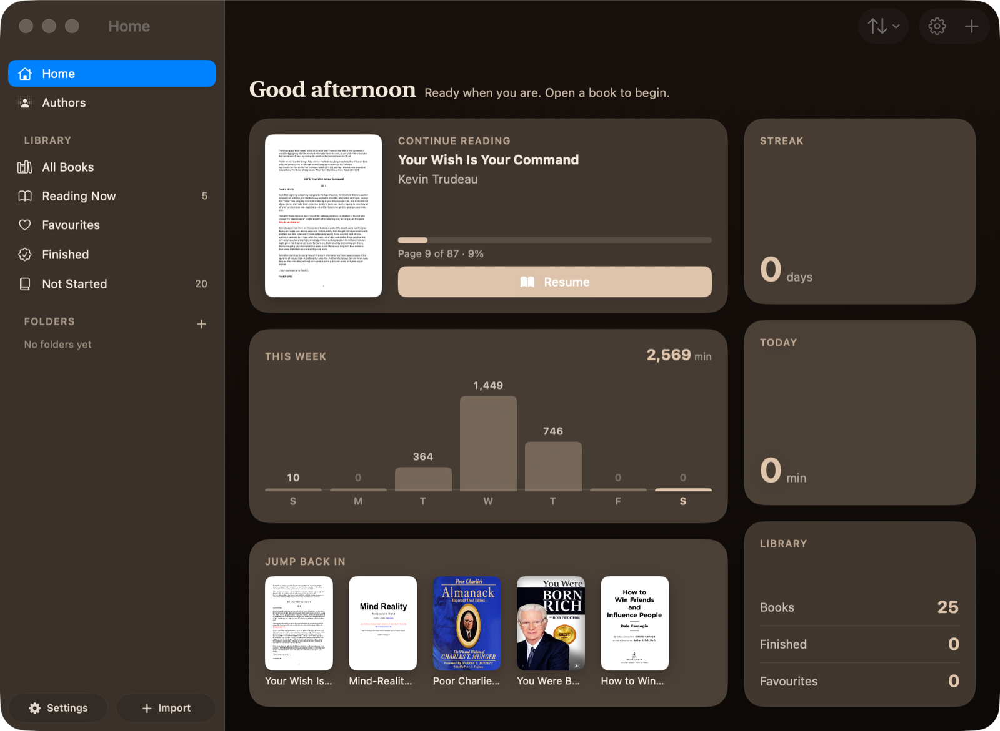
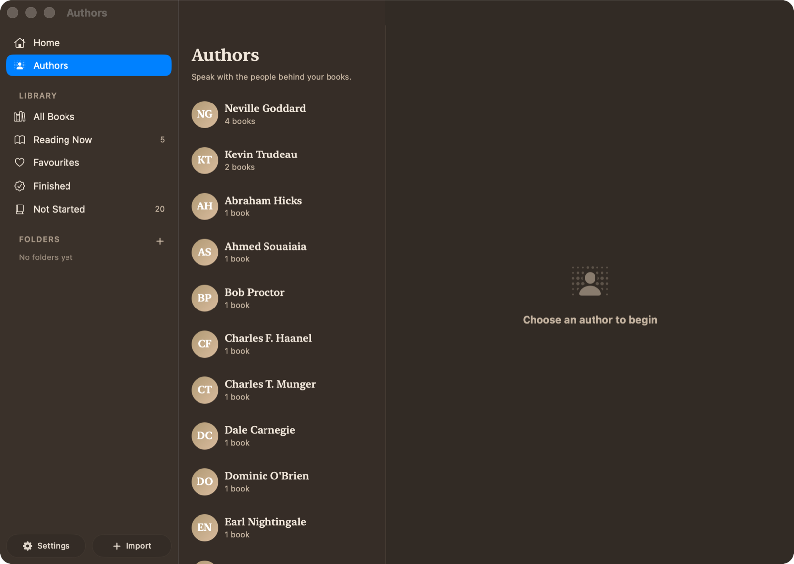

<div align="center">

# Flipbook

**A native macOS reader that treats a PDF like a book — and lets you talk to the people who wrote them.**

[](https://www.apple.com/macos/)
[](https://swift.org)
[](https://developer.apple.com/xcode/swiftui/)
[](LICENSE)
[](#-ai-that-actually-knows-your-books)

</div>

---

Most PDF readers show you a document. Flipbook gives you a **book** — a two-page spread with a
spine, paper edges, and a page that lifts, shades itself as it rises, and falls under your finger.
Then it adds the thing a paper book can't: **the author, available to talk.**

<div align="center">
  
</div>

---

## Why this exists

Reading apps tend to fail in one of two directions. Either they're a thin wrapper around a PDF view
with no sense of occasion, or they bolt on an AI sidebar that summarises text it barely understands
and answers in the same flat corporate voice as everything else.

Flipbook takes both parts seriously:

- **The reading surface is hand-built.** The page turn is a Core Animation transform tracked 1:1
  against your trackpad, with per-face shading, a cast shadow that moves with the lifting sheet,
  and a spring that carries your gesture's velocity. It's interruptible, reversible, and doesn't
  drop frames mid-turn.
- **The AI is grounded in the actual books.** Not a vague impression of the title — a distilled
  reference document built from the full text, cached, and injected as the author's own memory.

---

## Features

### 📖 The reading experience

| | |
|---|---|
| **Book mode** | Two-page spread with cover board, centre spine, and stacked page edges that shift as you read. Turn with a trackpad swipe or the arrow keys. |
| **Realistic page turns** | Interruptible 3D flips with per-face shading, a moving cast shadow, trilinear filtering, and velocity-carried spring settling. |
| **Continuous scroll** | A lazy vertical stack of rendered pages with book-like gaps and paper shadows, plus pinch-to-zoom. |
| **Reflow mode** | The book's text re-typeset natively in your choice of serif, sans, rounded, or mono — coloured by the active theme. |
| **9 reading themes** | Warm Paper · Eggshell · Cream · Beige · Sepia · Original · Dark Grey · Midnight · True Black, with warmth and brightness trim. |
| **Auto contents** | PDFs with no table of contents get one synthesised from printed contents pages and font-metric heading detection. |
| **Night mode** | Switches to your dark theme between 8 PM and 7 AM, and back in the morning. |
| **Focus mode** | Nothing but the book: chrome hidden, sidebar collapsed, full screen. |

### ✍️ Annotation

- **Freehand highlighter** — drag to mark, tap a mark to erase, with a discoverable marker bar
- **Sticky notes** — drop one anywhere on a page, drag it, click to collapse
- **Bookmarks** with a ribbon on the page (⌘D)
- **Real text selection** on text PDFs, falling back to region highlighting on scans

### 🗂 Library

- Shelves that compute themselves: **All Books · Reading Now · Favourites · Finished · Not Started**
- **Folders**, search, and sorting by date added, last read, title, or author
- **Rename and edit** any book's metadata
- **Reading dashboard** — daily minutes, a weekly chart, streaks, and a daily goal
- Drag-and-drop import, ⌘O, or **Open With → Flipbook** from Finder
- Books are referenced by security-scoped bookmark, so **moving a PDF doesn't break your library** —
  and if it ever does, a "Locate File…" flow relinks it

### 🤖 AI that actually knows your books

- **Ask about the page you're on** — the assistant receives the current page's text automatically
- **Talk to the Author** — converse with the writer behind any book in your library
- **Choose the scope** — one specific book, or everything that author wrote
- **Multiple saved conversations** per author, persisted across launches
- **Four providers, your key** — Anthropic (Claude), OpenAI, Google Gemini, and YUNWU
- **Personalisation** — assistant name, response style, and standing instructions

---

## Talking to authors

<div align="center">
  
</div>

Every author in your library becomes someone you can sit down with. Ask what they actually meant,
where readers misread them, or for advice on something you're stuck on — and get an answer in their
voice, arguing their positions, quoting their own lines back at you.

Their replies render in serif, unbubbled, on a measured column. It reads like a letter, not a chat app.

### The hard part: a book is too big to send

A 400-page book is roughly **250,000–1,000,000 tokens**. You can't put that in a prompt on every
message — not affordably, and mostly not at all. So Flipbook distils it **once**, with a map–reduce
pipeline built around cost:

```
   Full book text
         │
         ▼
   ~28k-char chunks  ──▶  summarised 4-at-a-time by the provider's CHEAPEST model
                          (Claude Haiku · gpt-5-mini · Gemini Flash)
         │
         ▼
   chunk notes (a few thousand tokens)
         │
         ▼
   ONE compose call on your main model
         │
         ▼
 ┌───────────────────────────────────────────────────────────────┐
 │  BookDigest — cached forever in SwiftData                     │
 │  Overview · Core Arguments · How It Unfolds · Key Terms ·     │
 │  Voice · Worldview · Quotable Lines (verbatim)                │
 └───────────────────────────────────────────────────────────────┘
```

Because ~99% of the tokens are spent in the map phase, and the map phase runs on the cheap tier,
**distilling a whole book costs cents rather than dollars** — and only ever happens once per book.
A unit test asserts the bulk model is never the flagship, so that property can't silently regress.

The persona is built the same way. `AuthorPersonaBuilder` writes a durable character file —
biography, convictions, how they reason, voice with sample phrasings, their body of work, how they
characteristically advise — grounded in those digests plus the model's own knowledge of the real
person. It's cached as an `AuthorPersona` and composed with the in-scope digests at conversation time.

---

## Privacy

Flipbook has no backend. No account, no telemetry, nothing uploaded anywhere.

- **Your API keys live in the macOS Keychain** — one per provider, never in SwiftData, never in a
  plain file, never in this repo.
- **Requests go straight from your Mac to the provider you chose**, over TLS. They never pass
  through any server of ours, because there isn't one.
- **Your books never leave your machine**, except as the text you deliberately send to your own AI
  provider — and page-context sharing can be switched off entirely in Settings.

---

## Getting started

### Requirements

- macOS 26 or later
- Xcode 26+ (Swift 6.2)
- [XcodeGen](https://github.com/yonaskolb/XcodeGen) — `brew install xcodegen`

### Build and run

```bash
git clone https://github.com/rayhankhilji/flipbook.git
cd flipbook

# The Xcode project is generated from project.yml, not checked in as source of truth
xcodegen generate

open Flipbook.xcodeproj    # then ⌘R
```

> **Note**
> Re-run `xcodegen generate` whenever you add or remove a source file.

### Tests

```bash
cd Packages/FlipbookCore && swift test

# Themed-page snapshot PNGs, for visual inspection
SNAPSHOT_DIR=/tmp/snaps swift test --filter VisualSnapshotTests
```

### Turn on the AI features

1. **⌘,** to open Settings, then the **AI** tab
2. Pick a provider — Anthropic, OpenAI, Google Gemini, or YUNWU
3. Paste your API key, hit **Save Key**, then **Test Connection**
4. Toggle **Enable AI features** on

The model field is free text with presets, so a newly released model works the day it ships without
waiting for an app update.

| Provider | Get a key |
|---|---|
| Anthropic (Claude) | [console.anthropic.com](https://console.anthropic.com/settings/keys) |
| OpenAI | [platform.openai.com](https://platform.openai.com/api-keys) |
| Google Gemini | [aistudio.google.com](https://aistudio.google.com/apikey) |
| YUNWU | [yunwu.ai](https://yunwu.ai) |

---

## Architecture

An app shell over two local Swift packages, so the domain logic is testable without launching a window.

```
Flipbook/
├── Flipbook/                     # App target — SwiftUI scenes and AppKit bridges
│   ├── App/                      # AppModel, scene commands, window configuration
│   └── Features/
│       ├── Library/              # Shelves, folders, search, import, book editing
│       ├── Dashboard/            # Reading stats, streaks, goals
│       ├── Reader/               # Reading surfaces + PageTurn/ (Core Animation)
│       ├── Highlights/           # Highlighter, sticky notes, annotation overlays
│       ├── AI/                   # Chat panel, author personas, Markdown rendering
│       └── Settings/             # Preferences window
│
└── Packages/
    ├── FlipbookCore/             # No SwiftUI dependency — pure domain
    │   ├── AI/                   # Providers, streaming service, distiller, personas
    │   ├── Document/             # PDF access, spread geometry, reflow extraction
    │   ├── Rendering/            # PageRenderer actor, image cache, theme compositor
    │   ├── Models/               # SwiftData models
    │   └── Persistence/          # ModelContainer factory
    └── FlipbookDesignSystem/     # Colour, type, spacing, motion tokens; components
```

**Decisions worth calling out:**

- **`PageRenderer` is an actor.** All PDFKit drawing is serialised off the main thread by
  construction; the main thread only ever receives finished `CGImage`s. Renders are cached by
  (page, zoom bucket, theme), so a page is never rasterised twice.
- **The page turn drops to AppKit.** An interruptible, gesture-tracked, reversible 3D turn isn't
  expressible with SwiftUI's fire-and-forget transitions, so `PageTurnNSView` owns a Core Animation
  layer tree directly.
- **Themes are baked into the bitmap, not layered over it.** A Core Image compositor applies each
  theme once per cached page — including a lightness-preserving smart invert for dark themes that
  keeps photographs positive instead of colour-negating them.
- **There is no AI SDK.** Swift has no official client for any of these providers, so `AIService`
  speaks the raw wire protocols: Anthropic's Messages API, and OpenAI Chat Completions for the other
  three (Gemini through its OpenAI-compatible endpoint, YUNWU as a relay). Both formats stream over
  SSE behind one interface.

---

## Roadmap

- [ ] Curved page-curl deformation on the turning sheet
- [ ] Notes and reflections attached to a highlight, with dated threads
- [ ] Rich attachments — images and auto-embedding links
- [ ] EPUB alongside PDF
- [ ] Per-book theme overrides, annotations export, and OCR for scanned PDFs
- [ ] Quick Look preview extension, Sparkle updates, notarised builds

---

## Contributing

Issues and pull requests are welcome. If you're changing the reading surface, please include a short
screen recording of the page turn — it's the easiest part of the app to regress and the hardest to
review from a diff.

---

## License

[MIT](LICENSE) © 2026 Rayhan Khilji

<div align="center">
<sub>Built with SwiftUI, AppKit, SwiftData, Core Animation, and Core Image.</sub>
</div>
